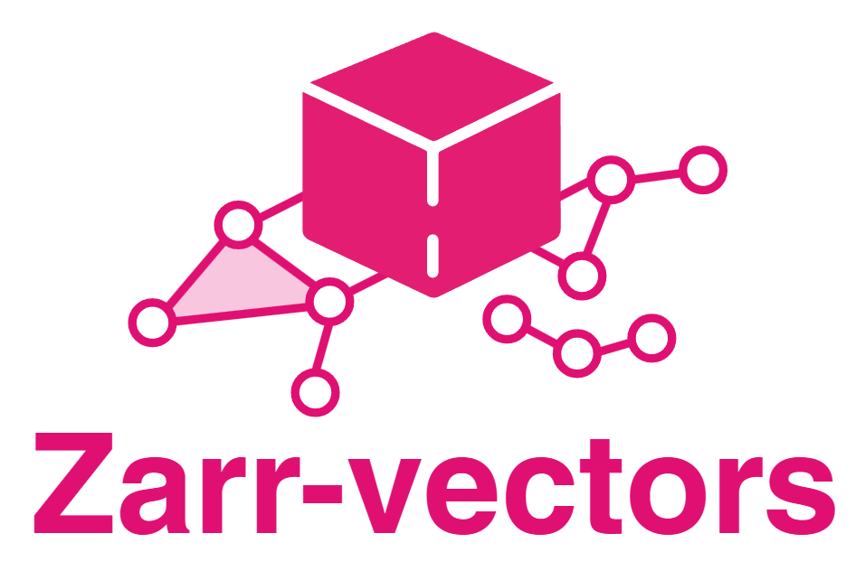

> [!NOTE]
> This package is under development and will change. It will also be migrated to another location once completed.



# zarr-vectors-tools

**File format workflows and basic algorithms for Zarr Vectors.**

`zarr-vectors-tools` is the companion workflow package to [`zarr-vectors-py`](https://github.com/Andrew-Keenlyside/zarr-vectors-py). The core read/write APIs (chunking, sharding, multiresolution, spatial binning) live in the `zarr_vectors` package. This package adds format-conversion workflows that wrap third-party readers and writers, plus example notebooks demonstrating end-to-end pipelines.

*Aligned to the Zarr Vectors specification by Forrest Collman, Allen Institute for Brain Sciences.*
[Specification](https://github.com/AllenInstitute/zarr_vectors)

---

## Install

```bash
pip install zarr-vectors-tools
```