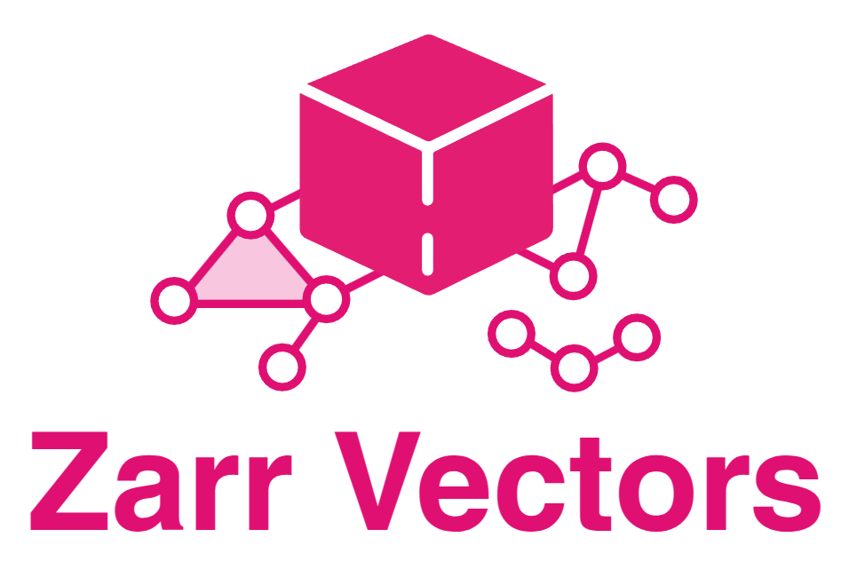

> [!NOTE]
> This package is under development and will change. It will also be migrated to another location once completed.



# zarr-vectors-tools

**File format workflows, algorithms, and multiresolution for Zarr Vectors.**

**`zarr-vectors-tools` is an extension of [`zarr-vectors-py`](https://github.com/Andrew-Keenlyside/zarr-vectors-py).** It is not a standalone library, and neither this README nor its documentation restates that package's.

`zarr-vectors-py` owns **Zarr Vectors** — the specification and the Python API over it: store layout, chunk and bin geometry, fragments, links, the object model, resolution-level metadata, validation, and the two supported surfaces `zarr_vectors.api` and `zarr_vectors.building`. Anything about the format or the core API is documented [there](https://zarr-vectors-py.readthedocs.io/en/latest) and only there.

This package adds the layers built on top of it: format-conversion workflows wrapping third-party readers and writers, streaming graph and mesh algorithms, the rich multiresolution coarsening layer, and the `zvtools` CLI.

*Zarr Vectors was originally specified by Forrest Collman, Allen Institute for Brain Sciences.*

| | |
| --- | --- |
| Documentation (this package) | [zarr-vectors-tools docs](https://zarr-vectors-tools.readthedocs.io/en/latest) |
| **Parent package** | [zarr-vectors-py](https://github.com/Andrew-Keenlyside/zarr-vectors-py) · [docs](https://zarr-vectors-py.readthedocs.io/en/latest) |
| **Specification** | [Zarr Vectors specification](https://zarr-vectors-py.readthedocs.io/en/latest/spec/index.html) |
| **Core API reference** | [zarr_vectors.api / zarr_vectors.building](https://zarr-vectors-py.readthedocs.io/en/latest/api/index.html) |
| Upstream specification | [AllenInstitute/zarr_vectors](https://github.com/AllenInstitute/zarr_vectors) |

---

## Install

```bash
pip install zarr-vectors-tools
```

Python ≥ 3.11. Every file format is gated behind an extra, so a base install stays slim:

```bash
pip install "zarr-vectors-tools[trk]"           # nibabel (TRK)
pip install "zarr-vectors-tools[streamlines]"   # nibabel + trx-python
pip install "zarr-vectors-tools[all]"           # everything except gpu
```

Extras: `las`, `ply`, `trk`, `trx`, `streamlines`, `graph`, `points-enrichment`, `mesh`, `precomputed`, `parallel`, `gpu`, `all`, `dev`.

> [!IMPORTANT]
> This package requires the merged `links/<delta>/<offsets>/` layout — on-disk **format 0.9.0** — in which connectivity is a single family and there is no `cross_chunk_links/` to fall back to. That format ships in the current core *development* line, whose *package* version is still 0.2.x; format version and package version are independent. The reliable install is an editable core working tree:
>
> ```bash
> git clone https://github.com/Andrew-Keenlyside/zarr-vectors-py
> pip install -e ./zarr-vectors-py
> ```

## Quick start

From the terminal:

```bash
zvtools convert cells.csv cells.zarrvectors --chunk-shape 100,100,100
zvtools pyramid cells.zarrvectors --coarsen 8,8 --sparsity 2,2
zvtools merge cells.zarrvectors more_cells.csv       # append, don't replace
zvtools split cells.zarrvectors parts/ --by groups
zvtools info cells.zarrvectors
zvtools validate cells.zarrvectors --level 3
```

From Python — note that `ingest` and `export` have no re-exports, so import from the concrete module:

```python
from zarr_vectors_tools.ingest.csv_points import ingest_csv
from zarr_vectors_tools.multiresolution.coarsen import build_pyramid
from zarr_vectors_tools.algorithms import compute_connected_components

ingest_csv("cells.csv", "cells.zarrvectors", chunk_shape=(100.0, 100.0, 100.0))
build_pyramid("cells.zarrvectors", factors=[(8.0, 2.0), (8.0, 2.0)])
```

## What's in it

| Subpackage | Purpose |
| --- | --- |
| `ingest` | CSV/XYZ, LAS/LAZ, PLY, line CSV, TCK, TRK, TRX, SWC, precomputed skeletons, OBJ, STL, edge-list CSV, GraphML |
| `export` | CSV, PLY, TRK, TRX, SWC, OBJ |
| `compose` | merge a file or another store into an existing one; split a store by group, label or merged source |
| `multiresolution` | pyramid building: skeleton/polyline/point/mesh/graph coarsening, five object-selection strategies, cross-level links |
| `algorithms` | streaming graph search, connected components, clustering; mesh summary, attributes, spatial queries |
| `headers` | format-specific metadata preservation |
| `cli` | the `zvtools` command line |

Coarsening and sparsity are two orthogonal axes — coarsening reduces vertices *within* each object, sparsity drops whole objects while preserving the IDs of survivors. See [Coarsening versus sparsity](https://zarr-vectors-tools.readthedocs.io/en/latest/multiresolution/concepts.html).

## Development

```bash
git clone https://github.com/AllenInstitute/zarr-vectors-tools
cd zarr-vectors-tools
pip install -e ".[all,dev]"
pytest
```

Build the docs locally:

```bash
pip install -r docs/requirements-docs.txt
python -m sphinx -b html docs docs/_build/html
```

## License

BSD-3-Clause.
