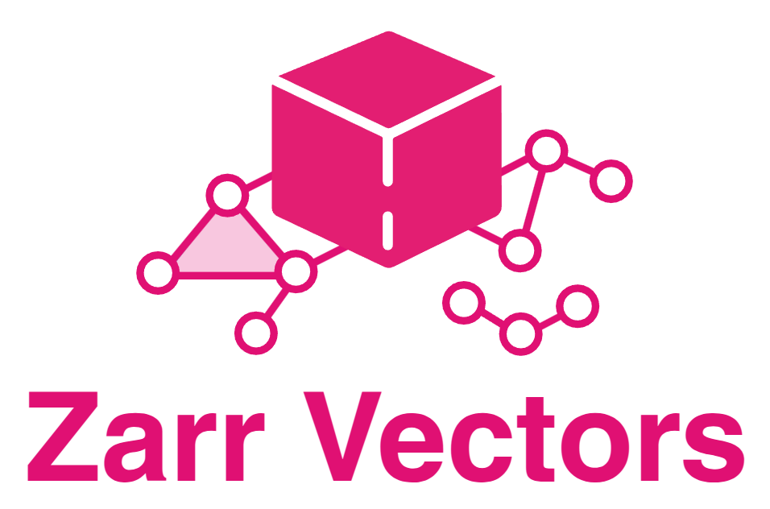

.. zarr-vectors-tools documentation master file

----

**zarr-vectors-tools** converts neuroscience geometry — point clouds,
single-cell tables, tractography, skeletons, meshes, cortical surfaces and
graphs — into `Zarr Vectors <https://alleninstitute.github.io/zarr_vectors/>`__
stores and back, builds multiresolution pyramids for viewing, and runs
algorithms over stores too large to load at once. Its command line is
``zvtools``.

It extends `zarr-vectors-py <https://zarr-vectors-py.readthedocs.io/en/latest>`__,
which owns the format and its core Python API. Questions about the store layout,
metadata or the ``zarr_vectors`` API are answered there: see the
:zvpy:`specification <spec/index.html>` and the :zvpy:`core API reference
<api/index.html>`. This package targets Zarr Vectors format |zv_version|.

.. code-block:: bash

   pip install zarr-vectors-tools
   zvtools convert cells.csv cells.zv --chunk-shape 100,100,100 --bin-shape 10,10,10 \
       --coarsen 2,2 --sparsity 1,1 --cross-level-storage none
   zvtools convert cells.zv cells_out.csv

Where to start
--------------

.. list-table::
   :widths: 30 70

   * - :doc:`quickstart`
     - Convert a table, build a pyramid, inspect it and export it again.
   * - :doc:`convert/index`
     - Every input and output format, and the options they share.
   * - :doc:`store_layout` and :doc:`pyramids`
     - The values to choose for chunk and bin shape, compression, sharding and
       pyramid levels.
   * - :doc:`visualise`
     - View a store in the BRIDGE Neuroscience Neuroglancer fork.
   * - :doc:`reference/cli`
     - Every ``zvtools`` subcommand and flag.

The format was originally specified by Forrest Collman at the Allen Institute
for Brain Science. Source and issues:
`github.com/AllenInstitute/zarr-vectors-tools
<https://github.com/AllenInstitute/zarr-vectors-tools>`__.

.. toctree::
   :maxdepth: 1
   :caption: Getting started
   :hidden:

   install
   quickstart
   concepts

.. toctree::
   :maxdepth: 1
   :caption: Convert
   :hidden:

   convert/index
   convert/points
   convert/single_cell
   convert/streamlines
   convert/skeletons
   convert/meshes
   convert/surfaces
   convert/graphs

.. toctree::
   :maxdepth: 1
   :caption: Build and view
   :hidden:

   store_layout
   pyramids
   pyramid_reference
   visualise
   compose
   large_data

.. toctree::
   :maxdepth: 1
   :caption: Algorithms
   :hidden:

   algorithms/index
   algorithms/graphs
   algorithms/meshes
   algorithms/streamlines_skeletons

.. toctree::
   :maxdepth: 1
   :caption: Reference
   :hidden:

   reference/cli
   reference/headers_attributes
   api/index
